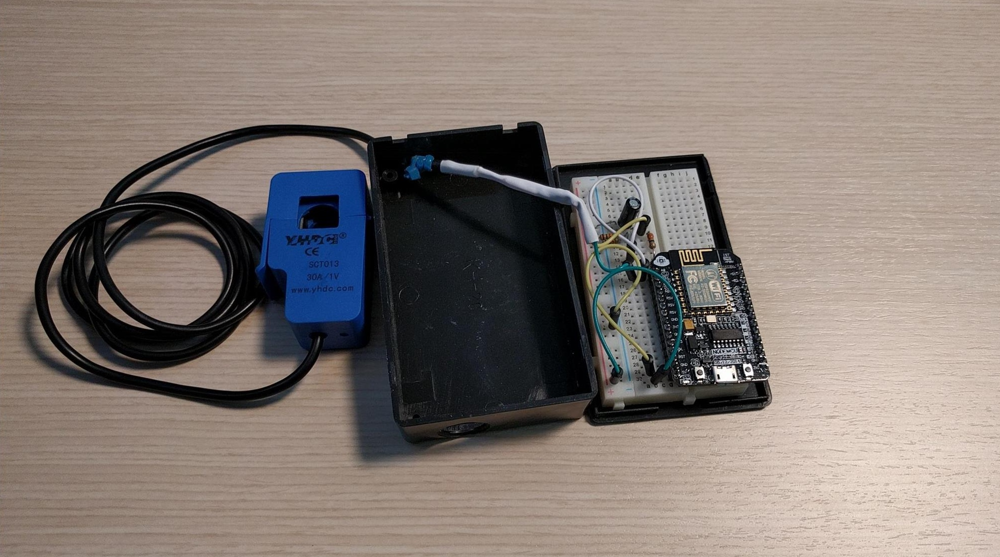
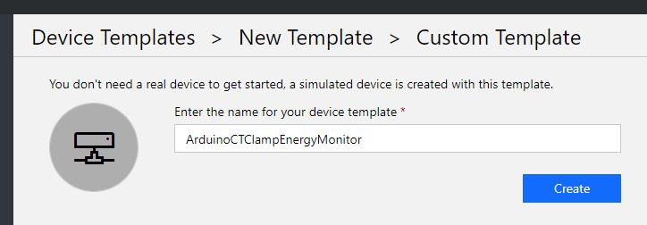
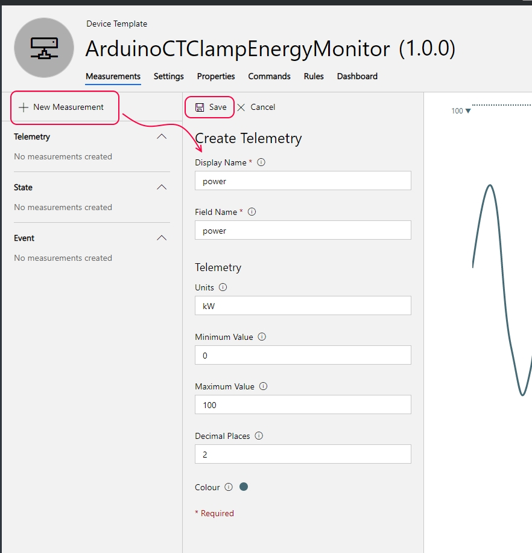

# Universal Energy Monitoring With Azure
Monitoring energy usage of any device via Azure using a simple Arduino based Energy Monitor



## Pre-requisite
Windows PowerShell (>= 5.1, `get-host|Select-Object version` to get the version)
1. You need an Azure Subscription and need to have Contributor role on the subscription. You should also have up to date versions of Visual Studio and [.NET Core](https://dotnet.microsoft.com/download) installed.
2. Azure PowerShell Module 
    + [Install Azure Powershell](https://docs.microsoft.com/en-us/powershell/azure/install-az-ps?view=azurermps-6.13.0)
    + Go to Powershell (Admin-role):
      ```Powershell
      Install-Module -Name AzureRM -AllowClobber
      Install-Module -Name AzureAD -AllowClobber
      Install-Module -Name Invoke-MsBuild -AllowClobber
      ```
3. A computer with Git client installed.
4. Install Visual Studio 15.5 (and up)

## Deploying the Azure Components to your Azure Subscription:
1. Clone the repo:

```shell
git clone https://github.com/conork20/UniversalEnergyMonitorWithAzure.git
cd UniversalEnergyMonitorWithAzure\AzureDeployment
```

2. Deploy new service with PowerShell

Launch **new PowerShell session** and connect to Resource Manager and Azure Active Directory with the account that be used as deployment admin.

```PowerShell
Connect-AzureRmAccount
Connect-AzureAD
```

Select subscription where you want to deploy resources.

```PowerShell
Set-AzureRmContext -SubscriptionId <SubscriptionId>
```

Create new resource group and create core resources of the service.

```
.\New-ServiceResources.ps1 -ResourceGroupName <group>
```

## Configuring IoT Central to Receive Telemetry from the Energy Monitor
1. First, create a Device Template in your IoT Central Instance to match the telemetry the Arduino device will be sending in. Follow the steps outlined [Set up a device template](https://docs.microsoft.com/en-us/azure/iot-central/howto-set-up-template). Configure the device telemetry points of power and kwh as time series telemetry datapoints as such: 





2. Now add under Device Explorer, [add a device](https://docs.microsoft.com/en-us/azure/iot-central/tutorial-add-device) of the Energy Monitor Device Template which to couple the physical energy monitor with to send in and monitor it's energy reading data:


3. With the IoT Central device instance created, the last step is to Generate the connection string which you will configure in the code running on the Arduino so it can securely send it's sensor data into IoT Central. To do this, follow steps 1 through 7 in [Generate the connection string](https://docs.microsoft.com/en-us/azure/iot-central/tutorial-add-device#generate-connection-string). When you have the device connection string, you're ready to start sending in data, either from the simulated device service, or from the real Arudiono energy monitor in the following two sections. 


## Configuring a Simulated Energy Monitor to send in Data to IoT Central
1. If not already done, create an Azure Function App. See steps [here](https://docs.microsoft.com/en-us/azure/azure-functions/functions-create-first-azure-function)
2. Update [Application Settings in Portal](https://docs.microsoft.com/en-us/azure/azure-functions/functions-how-to-use-azure-function-app-settings#settings) for `voltage` to any integer value, `amperage` to any double value, and `connectionString` to your device's Iot Hub connection string. You can determine your connection string using [this tool](https://github.com/Azure/dps-keygen).
3. Publish [SyntheticSensorMessenger](./SyntheticSensorMessenger) to your Azure Function App. See [Steps for Visual Studio Code](https://code.visualstudio.com/tutorials/functions-extension/deploy-app) or [Steps for Visual Studio](https://blogs.msdn.microsoft.com/benjaminperkins/2018/04/05/deploy-an-azure-function-created-from-visual-studio/)

## Configuring the Real Arduino Energy Sensor to send in telemetry Simulated Device
[Instructions](./ESP8266/README.md)
